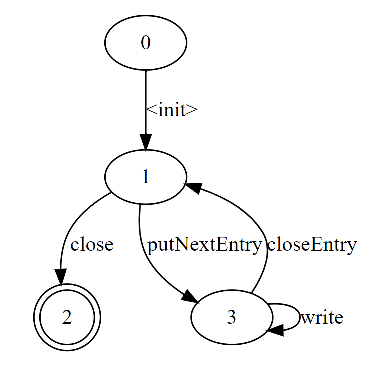

# KtLibMiner
Static analysis of library usage
## Options
- `-a,--all-projects` - download all found projects (only with jar assets by default))
- `-d,--depth-traversal <arg>` - max depth of trace for analysis or -1 for any depth (default 10)
- `-dm,--disable-merge` - disable merging of end states
- `-g,--goal <arg>` - the number of projects to be found (default 100)
- `-gp,--gradle-path <arg>` - path to installed gradle for build projects
- `-gv,--gradle-version <arg>` - gradle version for build projects
- `-h,--hold-db` - Allows you not to reset the accumulated data
- `-j,--jumps-traversal <arg>` - max len of trace for analysis (default 200)
- `-k <arg>` - minimum length of overlapping outgoing paths for a merge (default 1)
- `-l,--limit-trace <arg>` - max quantity of all traces for analysis or -1 for any quantity (default 10000000)
- `-m,--maven <arg>` - path to installed maven for build projects
- `-n,--name <arg>` - package name for analysis
- `-p,--prepared <arg>` - dir with prepared projects for analysis
- `-s,--signature` - use the signature in the analysis (by default, the method name is used)
- `-t,--token <arg>` - GitHub API token
- `-u,--use-trace` - inference with already collected traces (you can pass it param if you passed name)
- `-w,--workdir <arg>` - dir for output inference result and for cloning projects. required option!
## Usage example
`java -jar KtLibMiner-fat-1.0.jar -w \workdir\path -n java.util.zip.ZipOutputStream -t your_gh_token`
## Result example
- [Dot file](examples/java+util+zip+ZipOutputStreamOutUnion1.dot) (example for java.util.zip.ZipOutputStream)

- [JSON file](examples/java+util+zip+ZipOutputStream.json) (example for java.util.zip.ZipOutputStream)
## Used tools
- [Soot](https://github.com/soot-oss/soot)
- [MINT](https://github.com/neilwalkinshaw/mintframework/tree/master)